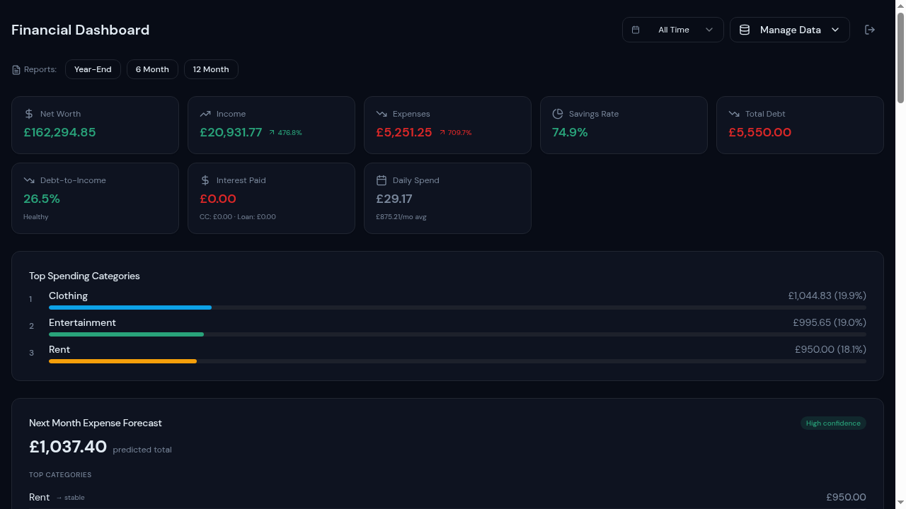
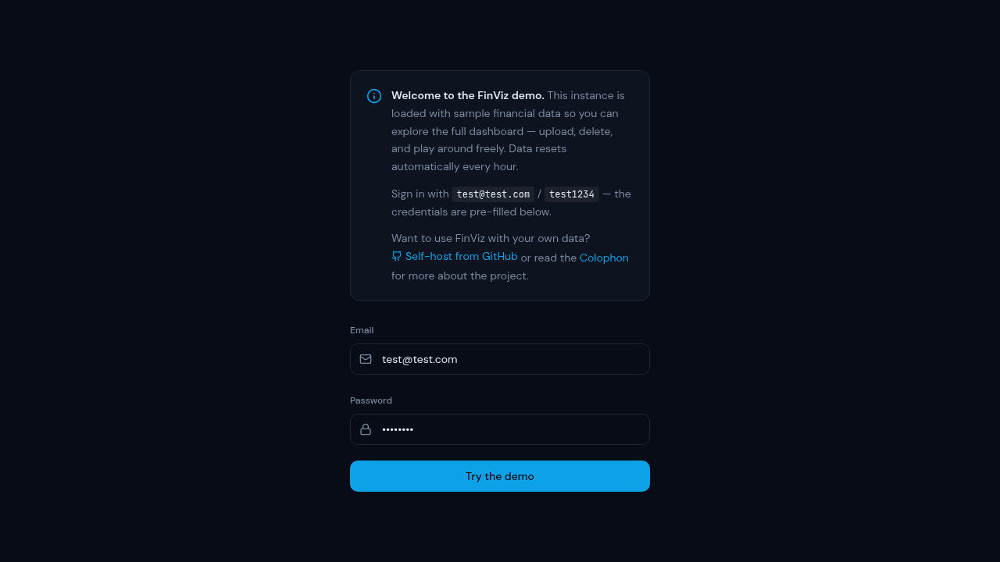

# FinViz — Personal Finance Data Visualiser

A self-hosted financial dashboard that turns CSV exports from double-entry
bookkeeping apps into interactive visualisations.



> **Disclaimer:** This tool is for data visualisation only and does not
> constitute financial advice.

## Try the Demo

You can try FinViz right now without installing anything:

👉 **[finviz.thamara.co.uk](https://finviz.thamara.co.uk)**



The demo is pre-loaded with sample financial data. You can explore all the
charts, upload your own CSV, delete data, and play around freely — the
sample data resets automatically every hour, so there's nothing you can
break.

## What Is FinViz?

FinViz is a private, self-hosted web app that helps you understand your
finances. You export your transactions as a CSV file from your bookkeeping
app, upload it to FinViz, and it creates charts and summaries showing:

- **Net worth** — your total assets minus liabilities, tracked over time
- **Income vs expenses** — monthly comparisons with trends
- **Category breakdowns** — where your money goes (Sankey diagrams)
- **Savings rate** — how much you're keeping each month
- **Expense forecasting** — predictions based on your spending patterns
- **Life runway** — how long your savings would last at current spending
- **Printable reports** — year-end and rolling summaries

Your data stays on your own server — nothing is shared with third parties.

## ⚠️ Important: Double-Entry Bookkeeping Only

FinViz is designed exclusively for **double-entry bookkeeping** data. It
expects CSV exports where every transaction has both an account and a
counter-account (the "from" and "to" sides of each entry).

### What works

- [Finances 2](https://hochsteger.com/finances/) (macOS/iOS) — default
  column mapping matches out of the box
- Any app that exports CSV with columns for: date, account, amount,
  currency, category, counter-account, note, payee, and cleared status

### What doesn't work

- Bank statement CSVs (single-entry, no counter-account)
- Mint / YNAB / Copilot exports (category-based, not double-entry)
- Spreadsheets without a consistent column structure

If your app uses double-entry bookkeeping but a different column order,
you can remap the columns — see [CSV Column Mapping](#csv-column-mapping)
below.

---

## Self-Hosting Guide

You don't need to be a developer to run FinViz. Follow the steps below —
each one explains *what* you're doing and *why*.

### What You'll Need

| Requirement | What it is | Where to get it |
| --- | --- | --- |
| **Docker** | A tool that runs apps in isolated containers — think of it as a "box" that contains everything FinViz needs | [Install Docker](https://docs.docker.com/get-docker/) (choose your OS) |
| **A computer that stays on** | FinViz runs as a server, so it needs a machine that's always available | Any Linux PC, Raspberry Pi, old laptop, or a cloud server (DigitalOcean, Hetzner, etc.) |
| **A terminal** | The command-line app on your computer | macOS: Terminal · Windows: PowerShell · Linux: any terminal |

> **Don't have Docker?** Follow the install link above. On Mac/Windows,
> install "Docker Desktop". On Linux, follow the guide for your distro.
> After installing, make sure Docker is running before continuing.

### Step 1: Download FinViz

Open your terminal and run these commands one at a time:

```bash
git clone https://github.com/thamarakandabada/finviz.git
cd finviz
```

**What this does:** Downloads the FinViz code to your computer and moves
into the project folder.

> **Don't have git?** You can also download the ZIP from the GitHub page
> (green "Code" button → "Download ZIP"), then unzip it and open the
> folder in your terminal.

### Step 2: Set Up Your Passwords

```bash
cp .env.example .env
```

**What this does:** Creates your personal configuration file. Now open
`.env` in any text editor (Notepad, TextEdit, VS Code, nano — anything
works) and fill in these values:

| Variable | What to put | How to generate it |
| --- | --- | --- |
| `POSTGRES_PASSWORD` | A strong random password for the database | Use a password manager, or run: `openssl rand -base64 24` |
| `JWT_SECRET` | A secret key for login tokens | Run: `openssl rand -base64 32` |
| `ANON_KEY` | The Supabase anonymous key | See [Supabase self-hosting docs](https://supabase.com/docs/guides/self-hosting) |
| `SERVICE_ROLE_KEY` | The Supabase admin key | Same link as above |

> **⚠️ Security:** The `SERVICE_ROLE_KEY` has full access to your database.
> Never share it, never put it in your frontend code, and never commit it
> to version control.

### Step 3: Start FinViz

```bash
docker compose up -d
```

**What this does:** Downloads and starts all the components FinViz needs
(database, authentication server, API, and the web app). The `-d` flag
runs everything in the background so you can close the terminal.

This may take a few minutes the first time. You'll see progress messages —
wait until they finish.

### Step 4: Create Your Account

```bash
chmod +x setup/create-user.sh
./setup/create-user.sh you@example.com your-password
```

**What this does:** Creates a user account so you can sign in. Replace
`you@example.com` and `your-password` with your actual email and a strong
password.

> **There is no signup page.** This is intentional — FinViz is a private
> tool, so accounts are created from the command line only.

### Step 5: Open FinViz

Open your browser and go to:

👉 **http://localhost:3000**

Sign in with the email and password you just created. You're ready to
upload your first CSV!

### Securing Your Instance

Your FinViz instance is currently only accessible on your local network. To
access it from anywhere or to make it more secure:

| What to do | Why | How |
| --- | --- | --- |
| **Add HTTPS** | Encrypts traffic so passwords can't be intercepted | Use [Caddy](https://caddyserver.com/) (easiest), nginx + Let's Encrypt, or [Cloudflare Tunnel](https://developers.cloudflare.com/cloudflare-one/connections/connect-apps/) |
| **Restrict access** | Limits who can reach your instance | Use a VPN like [Tailscale](https://tailscale.com/) (free for personal use) or [Cloudflare Access](https://www.cloudflare.com/products/zero-trust/) |
| **Back up your data** | Protects against data loss | Back up the `db-data` Docker volume regularly |

See `setup/nginx.conf` for an example reverse proxy configuration.

### Updating FinViz

When a new version is released:

```bash
git pull
docker compose down
docker compose up -d --build
```

**What this does:** Downloads the latest code, stops the old version, and
starts the new one. Your data is preserved — it lives in the database, not
in the app code.

---

## Running as a Public Demo

If you want to host a public demo so others can try FinViz with sample
data:

### 1. Create a demo user

```bash
./setup/create-user.sh demo@example.com demopassword
```

### 2. Upload sample data

Sign in as the demo user and upload your sample CSV.

### 3. Enable demo mode in the app

Set these environment variables before building:

```env
VITE_DEMO_MODE=true
VITE_DEMO_EMAIL=demo@example.com
VITE_DEMO_PASSWORD=demopassword
```

This shows an info panel on the login page with pre-filled credentials so
visitors can sign in with one click.

### 4. (Optional) Auto-reset demo data

The hosted demo at [finviz.thamara.co.uk](https://finviz.thamara.co.uk) uses a
scheduled background function that checks the demo account's data every
hour. If a visitor has deleted or modified the sample data, it
automatically restores it. When the data is untouched, the check is a
single lightweight query and uses virtually no resources.

For self-hosted demos, you can set up a similar cron job — see
`supabase/functions/reset-demo-data/` for the implementation.

> **Note:** `VITE_` variables are baked into the JavaScript bundle and
> visible to anyone who inspects the page. This is fine for demo
> credentials, but **never** put real passwords in `VITE_` variables.

---

## Configuration

All configuration lives in `src/lib/app-config.ts` and can be overridden
via environment variables:

| Variable | Default | Description |
| --- | --- | --- |
| `VITE_CURRENCY_CODE` | `GBP` | ISO 4217 currency code (e.g. `USD`, `EUR`) |
| `VITE_LOCALE` | `en-GB` | Locale for number/date formatting (e.g. `en-US`, `de-DE`) |
| `VITE_DEMO_MODE` | `true` | Show demo info panel & pre-fill credentials |
| `VITE_DEMO_EMAIL` | `test@test.com` | Email pre-filled in demo mode |
| `VITE_DEMO_PASSWORD` | `test1234` | Password pre-filled in demo mode |

### CSV Column Mapping

The default column map matches **Finances 2** CSV exports. If your app uses
a different column layout, edit the `CSV_COLUMNS` object in
`src/lib/app-config.ts`:

```ts
export const CSV_COLUMNS: CSVColumnMap = {
  date: 0,          // Column index for transaction date
  account: 1,       // Account name
  amount: 2,        // Transaction amount
  currency: 3,      // Currency code
  category: 4,      // Category (supports hierarchical "Parent:Child")
  counterAccount: 5, // Counter-account for transfers
  note: 6,          // Transaction note/memo
  payee: 7,         // Payee name
  cleared: 9,       // Cleared status column
  minColumns: 10,   // Minimum columns for a valid row
  clearedValue: "*", // Value that means "cleared"
};
```

### Account Classification

Accounts are automatically classified as **assets** or **liabilities**
based on their name. Accounts containing "credit card", "loan", or
"prepaid loan fees" are treated as liabilities; everything else is an
asset. To customise this, edit `classifyAccount()` in
`src/lib/csv-parser.ts`.

---

## Troubleshooting

### "Port 3000 is already in use"

Another app is using port 3000. Either stop that app, or change the port
in `docker-compose.yml` (look for `"3000:80"` and change the first number,
e.g. `"8080:80"`), then visit `http://localhost:8080` instead.

### "Cannot connect to the Docker daemon"

Docker isn't running. Open Docker Desktop (Mac/Windows) or start the Docker
service (`sudo systemctl start docker` on Linux).

### "Permission denied" when running scripts

Make the script executable first:
```bash
chmod +x setup/create-user.sh
```

### Data isn't showing after upload

- Check that your CSV uses double-entry format (see requirements above).
- Make sure the column order matches your `CSV_COLUMNS` configuration.
- Look for error messages in the browser console (F12 → Console tab).

---

## FAQ

**Do I need to know how to code?**
No. You need to be comfortable running commands in a terminal, but you
don't need to write any code.

**Can I run this on a Raspberry Pi?**
Yes! FinViz runs well on a Raspberry Pi 4 or newer with Docker installed.

**Is my data sent anywhere?**
No. Everything runs on your machine. There are no analytics, telemetry,
or external API calls.

**Can multiple people use the same instance?**
Yes — each user gets their own isolated account. Create additional users
with `setup/create-user.sh`. Each user can only see their own data.

**What if I lose my password?**
Since there's no password reset flow, you'll need to create a new user
via the CLI script.

---

## Tech Stack

- **Frontend:** React 18, TypeScript, Vite, Tailwind CSS, shadcn/ui, Recharts
- **Backend:** Supabase (Postgres + Auth + REST API)
- **Deployment:** Docker Compose or any static host + Supabase

## Development

```bash
npm install
npm run dev        # Start dev server on :5173
npm run build      # Production build
npm run test       # Run tests
```

## Project Structure

```
src/
├── lib/
│   ├── app-config.ts    # Currency, locale, CSV column mapping
│   └── csv-parser.ts    # CSV parsing & account classification
├── components/
│   ├── AppFooter.tsx     # Shared footer with GitHub & colophon links
│   ├── AuthProvider.tsx  # Auth context
│   └── FinancialReport.tsx  # Printable reports
├── pages/
│   ├── FinancialDashboard.tsx  # Main dashboard
│   ├── Login.tsx         # Login page with demo info panel
│   └── Colophon.tsx      # About/tech stack page
setup/
├── schema.sql            # Database schema
├── create-user.sh        # User creation script
├── mark-demo-user.sh     # Mark a user as demo account
└── nginx.conf            # Production nginx config
supabase/
└── functions/
    └── reset-demo-data/  # Hourly demo data auto-reset
```

## Security

See [SECURITY.md](SECURITY.md) for the full security architecture,
responsible disclosure policy, and hardening recommendations.

## Contributing

See [CONTRIBUTING.md](CONTRIBUTING.md).

## License

[MIT](LICENSE)
